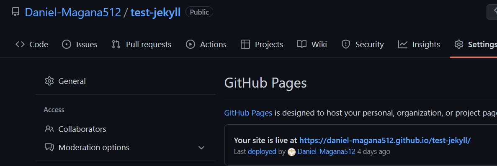
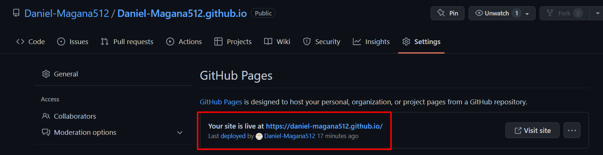
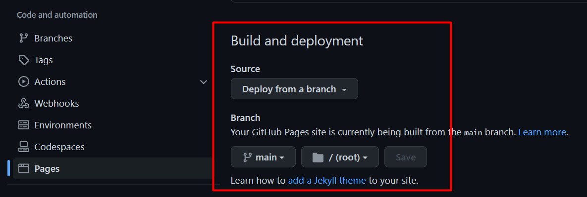
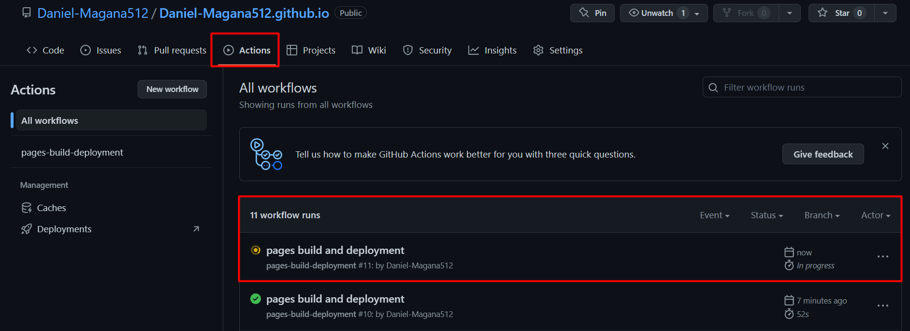

# **Práctica: Creación de blogs con Jekyll y GitHub Pages**

*Jekyll es un generador de sitios web estáticos que nos permite crear de forma sencilla blogs, sitios webs personales...*
Los sitios webs que generamos con Jekyll no emplearán una base de datos, el contenido del sitio web está escrito en archivos de texto plano.*

*Jekyll es un servicio que ofrece GitHub a sus usuarios para que puedan publicar sitios webs estáticos alojados en los repositorios que tienen en GitHub.*

## **Creación de un contenedor Docker con Jekyll**

**Existen tres imágenes oficiales con Jekyll:**

* jekyll/jekyll: Default image.
* jekyll/minimal: Very minimal image.
* jekyll/builder: Includes tools.

Usaremos la primera que es la que viene por defecto, ya que es la más ligera.

## **Antes de todo**

Nos creamos un repositorio en github. Hay que tener en cuenta el nombre que le vamos a dar al repostorio, ya que si ponemos (nombre_de_la_cuenta_github).github.io nos aparecerá directemente el blog, pero si no ponemos el nombre de la cuenta en el repositorio la url para acceder será diferente.

*Un ejemplo del enlace de como quedaría si al repositorio **no le pongo el nombre de la cuenta de github, la url sería***

**https://daniel-magana512.github.io/test-jekyll/ (este último apartado hace referencía al nombre del repositorio)**



***Si hago lo que he mencionado de poner el nombre de la (cuenta_de_github).github.io.***




GitHub Pages es un servicio de alojamiento de sitio estático que toma archivos HTML, CSS y JavaScript directamente desde un repositorio en GitHub, opcionalmente ejecuta los archivos a través de un proceso de complilación y publica un sitio web. 

Una vez entendito esto , nos vamos a pages y configuramos este apartado de la siguiente manera :



## **Comandos que hay que ejecutar en el repositorio**

Importante todos los comandos que voy a explicar se requiere estar dentro de la ruta del repositorio.

Para consultar todos los comandos que podemos ejecutar con jekyll podemos ejecutar el siguiente comando:

```command
docker run -it --rm -v "$PWD:/srv/jekyll" jekyll/jekyll:3.8 jekyll
```

Este comando nos permite crear la estructura de directorios y los archivos necesarios de un nuevo proyecto Jekyll.

```command
docker run -it --rm -v "$PWD:/srv/jekyll" jekyll/jekyll:3.8 jekyll new blog
```

Este comando nos permite generar un sitio HTML estático a partir del contenido del proyecto Jekyll. (En este apartado se tiene que ejecutar dentro de la carpeta blog)

```command
docker run -it --rm -v "$PWD:/srv/jekyll" jekyll/jekyll:3.8 jekyll build
```

Este comando nos permite servir de forma local un sitio HTML estático generado a partir del contenido del proyecto Jekyll. (En este apartado se tiene que ejecutar dentro de la carpeta blog)

```command
docker run -it --rm -p 4000:4000 -v "$PWD:/srv/jekyll" jekyll/jekyll:3.8 jekyll serve --force_polling
```

**Cada vez que haya algún cambio, es importante subir al repositorio de github**

Nos vamos a actions y podemos ver que se está procesando el cambio:




